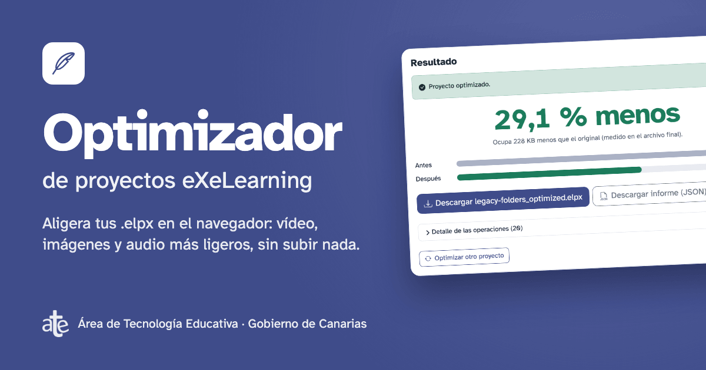

# elpx-optimizer

[](https://www.npmjs.com/package/elpx-optimizer)
[](https://hub.docker.com/r/ateeducacion/elpx-optimizer)
[](https://ateeducacion.github.io/elpx-optimizer/)
[](https://codecov.io/gh/ateeducacion/elpx-optimizer)

[](https://ateeducacion.github.io/elpx-optimizer/)

Makes [eXeLearning](https://github.com/exelearning/exelearning) projects (`.elpx`) lighter: smaller
videos, images, audio and PDFs, in a project that is still editable in eXeLearning. The original is
never touched.

[Leer en español](README.es.md)

## Web app

**[ateeducacion.github.io/elpx-optimizer](https://ateeducacion.github.io/elpx-optimizer/)**: drop
your `.elpx` and download the result. Everything runs in your browser; nothing is uploaded.

## Command line

```bash
npx elpx-optimizer optimize course.elpx
```

```bash
docker run --rm -u $(id -u) -v "$PWD:/work" ateeducacion/elpx-optimizer optimize course.elpx
```

Both write `course_optimized.elpx` next to the original. Add `--dry-run` to see the plan first.
`npx` needs Node.js 22 and FFmpeg for video and audio; the Docker image includes everything.
[All options →](docs/cli.md)

## What it does

- **Recompresses** videos, images, audio and PDFs, and keeps a new version only when it is valid
  and smaller.
- **Finds** missing, unused and duplicate files; on request it removes, merges and renames them.
- **Refreshes** the project thumbnail from its first page, or from an image of your choice.
- **Verifies** the whole package again before handing it over.

Also as an [Agent Skill](docs/skill.md) for AI assistants.

## More

[Presets and quality](docs/profiles.md) · [Web app](docs/web.md) · [CLI](docs/cli.md) ·
[Architecture](docs/architecture.md) · [Diagnostics](docs/diagnostics.md) ·
[Design decisions](docs/decisions.md) · [Testing](docs/testing.md) · [npm](docs/npm.md) ·
[eXeLearning format](docs/upstream-review.md) · [Contributing](CONTRIBUTING.md) ·
[Security](SECURITY.md)

AGPL-3.0-or-later. Third-party components keep their licenses; see
[THIRD-PARTY-NOTICES.md](THIRD-PARTY-NOTICES.md). Made by the Área de Tecnología Educativa of the
Government of the Canary Islands, whose logo is not covered by the project's license.
